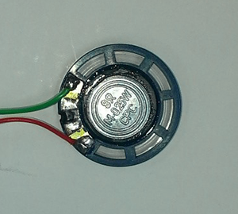
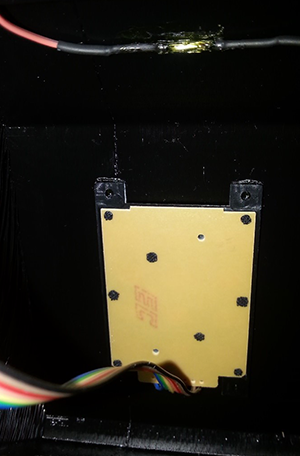

# Arduino Phone

Note: This project uses an older GSM module that is limited to 2G sim cards. We are currently working on an updated version of this project and plan to have that available soon.


Here's a novel and practical project that brings a touch of the '90's using 21st century technology. It's a phone that looks and behaves like an old touch-tone phone, but at its heart has a GSM shield and Arduino Uno. It's not an easy build- there's soldering and you might even need to modify the GSM shield. And the case has been 3d printed, so you might need to look at other build options if you don't have access to a 3d printer. Perhaps you have an old phone lying around?

We'll describe the build process we undertook, and along the way, we'll make a note of some alternatives that might work better for you. You'll also need a 2G compatible full-sized SIM card, if you want to use the phone to make and receive calls.

## Shopping List:

[1 x XC4410 Uno Main Board](p/XC4410)
[1 x XC4221 GSM Shield](p/XC4221)
[1 x XC4454 LCD Shield](p/XC4454)
[1 x SP0770 12 Key Pushbutton Matrix](p/SP0770)
[1 x AB3440 Piezo Transducer](p/AB3440)
[1 x AS3002 27mm Speaker](p/AS3002)
[1 x AM4010 Electret Microphone Insert](p/AM4010)
[2 x PP0136 Right Angle Stereo 3.5mm Plug](p/PP0136)
[1 x YT6047 3m Curly Handset Cord](p/YT6047)
[1 x SM1002 Reed Switch](p/SM1002)
[1 x LM1622 4 pack of Small Rare Earth Magnets](p/LM1622)
[1m x WM4516 16 Way Ribbon Cable](p/WM4516)

## Connections:

|Uno |GSM |LCD |Keypad |Piezo |Reed Switch |Function
|--- |--- |--- |--- |--- |--- |---
|5V |5V |5V ||||Power
|GND ||||Black |GND |Ground
|D0 (RX) |TX|||| |Data from GSM to Uno
|D1 (TX) |RX|||| |Data from Uno to GSM
|D2 |||6 |||Row 3
|D3 |||7 |||Row 2
|D4 ||D4 ||||Data to LCD
|D5 ||D5 ||||Data to LCD
|D6 ||D6 ||||Data to LCD
|D7 ||D7 ||||Data to LCD
|D8 ||RS||||Register Select
|D9 |Power |E||| |Enable (Clock) & GSM Power
|D10 ||LED ||||Backlight Control
|D11 ||||Red ||Tone Ringer
|D12 |||||Signal |Hook switch
|A0 ||Keys||||Keys on LCD
|A1 |||1 |||Column 2
|A2 |||2 |||Row 1
|A3 |||3 |||Column 1
|A4 |||4 |||Row 4
|A5 |||5 |||Column 3

## Construction:

Although we usually start by doing the physical build, in this case it'll be easier to program the Uno first- this is because the GSM shield uses the serial port pins and interferes with the programming data. Everything is in the sketch file- there are no libraries, so you can simply copy and paste the code from the end of this document. Program the Uno board without anything attached, insert the SIM card into the slot on the underside of the GSM shield and then attach the GSM shield. Ensure that the jumpers near the antenna are set to 'Xduino' and not 'SWserial' and that the VIN switch is set to 'Xduino'. Attach the LCD shield and power it up, and check that the GSM Shield and display are working. If the GSM shield is configured correctly, the display should read 'Ready…'. If it reads, 'GSM Module Fail', then the GSM shield isn't configured correctly, and the jumper settings should be checked.

The next step is to make a small modification to the GSM shield. This involves cutting the traces from A4 and A5, as we want to use them for the keypad matrix. They aren't even used by the shield, but are wired up to the main chip in a way that makes them unsuitable for other connections. You could skip this step if you don't want to use the matrix keypad. Very carefully, with a sharp object, cut through the traces and into the PCB below to disconnect them.


The next step is to connect up the matrix keypad:


And then solder the other end of the keypad, plus the AB3440 Piezo and the SM1002 Reed Switch (with some short flyleads) to the LCD Shield:


The 'Phone is now complete enough that you can test dialling. Before powering it all up, place a magnet next to the reed switch (this makes the 'Phone think that the handset is down on the receiver) and attach the antenna to the GSM shield (so it can get reception).

Connect the 'Phone to power, and after a few seconds, the screen should show "Ready…". If you dial the number of the SIM in the 'Phone, it should change to "Incoming call…" and the dialling number should also appear in the display (this may not occur if Calling Number Display is not working). If the magnet is moved away from the reed switch, it will change to "Call in Progress". Placing the magnet back near the reed switch will cause the display to return to "Ready…" and the call to be ended.

You can also test dialling on the keypad. With "Ready…" showing, dial a number (it should appear in the display), then remove the magnet from the reed switch, and the display changes to "Please dial..." followed by "Call in progress". If the other phone rejects the call or hangs up, the display will show "Replace handset.", which can be done by placing the magnet next to the reed switch. If any of this doesn't work, check the wiring. For example, if the wrong numbers appear on the display during dialling, the keypad may be wired wrong. If the sequencing doesn't seems right, the reed switch wiring might be wrong, or the magnet might not be triggering it correctly.

## Alternatives:

If you don't want to use a reed switch and magnet, pretty much any type of momentary switch can be used, such as a microswitch. The code assumes that the switch is open when the handset is picked up, but that can be changed by the line:

```c
 #define HSWITCHINVERT 0
 ```

And changing the 0 to 1.

The LCD shield isn't totally necessary, but helps a lot with debugging. If you don't intend to use the LCD shield, you could run the wires to the Uno itself, or a prototyping shield. There is a routine to read the number from the keys on the LCD- it needs to be enabled by setting the line:

```c
#define USELCDKEYPAD 0
```

To 1 instead of 0. Don't do this unless the LCD is attached, as unattached inputs may give phantom keystrokes. When entering the number this way, push up and down to change the digit, then right to move to the next digit.

Two other lines which you might wish to change at this stage are:

```c
#define CCODE "+61"
#define ACODE "+612"
```
These currently treat dialled number without a '0' STD prefix as though they are in the Sydney (02) area code, and all other numbers as though they are Australian numbers- so it's not possible to dial international numbers easily. These could be changed to:

```c
#define CCODE "+64"
#define ACODE "+649"
```
Which would treat all numbers as New Zealand, and numbers without a '0' prefix as Auckland local numbers.

If you want to easily dial international numbers, the following settings might be easiest:

```c
#define CCODE "+0"
#define ACODE "+"
```

In which case all numbers would have to include a country code.

## Further Construction:

As far as the electronics goes, all we need now are the microphone and speaker to be able to talk and listen on the 'Phone. We've used the YT6047 Curly Cord so that it looks like a proper handset cable, but anything that can provide 4 cores is fine. We've wired it up as follows:

* Red: Speaker +
* Green: Speaker –
* Yellow: Microphone +
* Black: Microphone –

The speaker in this case is the 27mm speaker and the electret microphone becomes the microphone. At the other end, they go to the stereo 3.5mm plugs, because the GSM shield has stereo 3.5mm sockets to connect to. Note that the negative connection goes to the large tab on the plug, and the positive connection goes to the two small tabs.




After this, the two stereo plugs can be plugged into the sockets on the GSM shield, and the 'Phone is functionally complete. The 'Phone can be powered up and used to make and receive calls. All that is left is the physical build and enclosing the 'Phone in a suitable case.

The below photo shows everything wired up- the blue and orange wires go off to the reed switch, while the ribbon cable (five strands at the bottom and two at the top) go to the keypad.


## 3D Printed Case:

We've designed some 3D files to create a 3D printed case- you could also use an existing case, or even fit it into something unusual- perhaps recreating [Maxwell Smart's shoe phone](https://en.wikipedia.org/wiki/Shoe_phone). This build will work with the 3D printed case.

The parts are simply printed (I used PLA) without scaling. There's a few spots where bridging might cause problems, but nothing that can't be fixed by judicious trimming. There are four parts to the print, and we found they are best printed one at a time- mostly because they are so big. As you can see, they won't all fit on the print bed of a [Finder](https://jaycar.com.au/p/TL4220) together.


We found it easiest to assemble the handpiece first. Glue the end of the curly cord to the end of the slot, and then you should only need to push the microphone and speaker into the holes, and then use the back of the handpiece to hold everything together. The magnet can also be glued into the small circle in the middle- this triggers the reed switch in the main unit. Either super-glue or epoxy type glues are fine.


We used some black electrical tape to hold everything together until we were sure it was working well.


After this comes the tricky task of getting everything into the enclosure. After making sure all the components are connected and the antenna is attached to the GSM shield, place the keypad into its hole in the front of the case, then insert the main board assemblies. The antenna end of the GSM shield should go in first. A critical step is placement of the reed switch, so that it is properly triggered by the magnet. An easy was to check this is to power up the 'Phone and placing the handset in the cradle. You'll know the reed switch is in the right place when the display reads 'Ready…'. If it reads 'Please Dial…' then the magnet is not properly activating the switch. We used a small amount of super glue, then let the magnet hold the reed switch in place as it sets.



Once all the glue is set, check the operation of the 'Phone. If everything is working well, the piezo transducer should also be glued inside the case, and the back cover can be attached. We've used a 9V battery with a 2.1mm DC Jack for power for testing, but this won't last very long. A 9V plug pack or USB power supply will provide operation if 240V is nearby.

Once everything appears to be working, it can all be glued permanently in place- the handset halves and the keypad can be secured, and we now have our finished phone:


## Improvements:

To give you an idea of how the project works, you can refer to the diagram at the start of the sketch code. A state machine is a device that exists in one of many states, and what it does at each state depends on the state and what input it receives. This is handled by the many 'if' statements in the body of the loop() function. This is why the 'Phone will do different things if the handset is picked up, depending on whether the 'Phone is ringing or not.

You've probably already dreamt up a few changes to this build, but if you're just reading through and trying to work out how you might build it with what you have available. If you don't think you need a keypad at all (say you only ever want to dial a single fixed number), you can change the dial() function to do just that:

```c
void dial(){    //dial the typed number
  gsm.print("ATD xxxxxxxx;");    //single fixed number to dial goes here xxxxxxxx
}
```

Note the semicolon, which is needed to tell the GSM module to make a voice (not data) call.

You'll also need to change this line:

``` c
if((HSUP==phonestate)&&(millis()-dialtmout>DIALTMOUTDELAY)&&(dialno[0]!=0)) {dial();phonestate=CALLIP;}    //dial number and assume call in progress #6
```

to remove the check for a blank number by removing the dialno[0]!=0 condition:

```c
if((HSUP==phonestate)&&(millis()-dialtmout>DIALTMOUTDELAY)){dial();phonestate=CALLIP;}    //dial number and assume call in progress #6
```

Which will cause the number to be automatically dialled when the handset is lifted.
If you don't like the pin arrangement, all the pins have been set by defines except the LCD in the line:

```c
LiquidCrystal lcd(8, 9, 4, 5, 6, 7); //(RS,E,D4,D5,D6,D7)
```

So they can easily be changed to suit. For example, if you aren't using the keypad, you may not need to modify the A4 and A5 pins on the GSM shield.

The line:

```c
tone(RINGER,500,800);     //sound ringer
```

is what generates the ringing tone, so if you don't like the sound of it, this is where it can be changed. The tone() function is used here because it returns control to the Arduino while the tone is still playing. Other functions might give better tones, but might give erratic results if the sketch spends too much time in this function.
